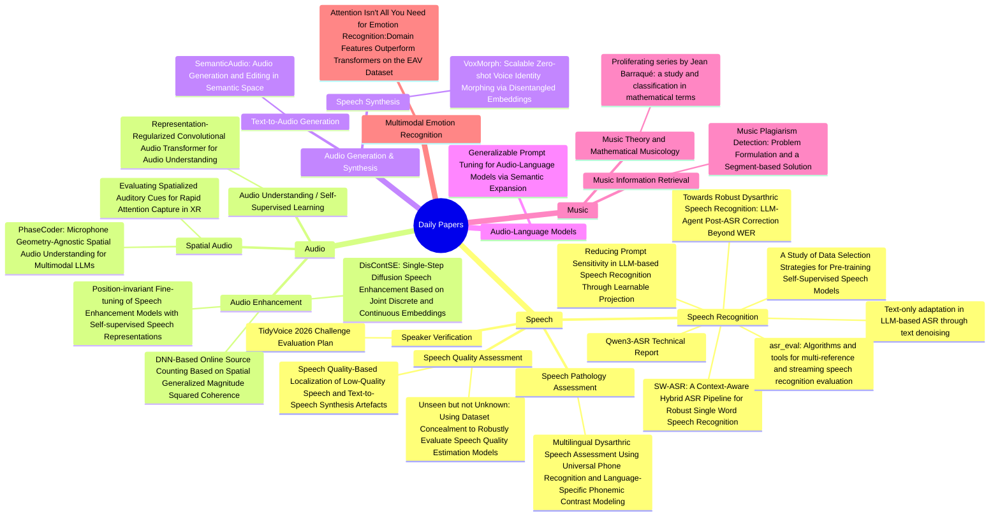
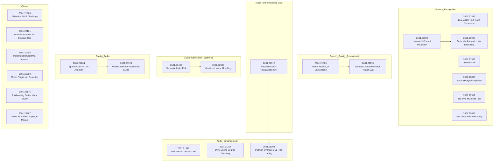

# Arxiv Daily Deep Report - 2026-02-05

**来源**: https://arxiv.org/list/eess.AS/recent
**篇数**: 23
---

## 🧠 技术归类思维导图

## 🔗 技术演进关系图

## 1. Proliferating series by Jean Barraqué: a study and classification in mathematical terms

**作者**: Isabel Tardón, Pablo Martín-Santamaría
**链接**: [2601.22176](https://arxiv.org/abs/2601.22176)
**分类**: Music Theory and Mathematical Musicology | **关键词**: Proliferating series, Jean Barraqué, serialism, permutations, group theory

## 核心痛点
传统十二音序列主义（经典序列主义）在构建序列时，通常基于音符之间的音程保持不变，这限制了作曲家在音程变化上的多样性，可能导致音乐材料重复或缺乏创新性。Jean Barraqué 的增殖序列方法通过引入新的不变性——即序列间音符的排列变换（置换），而非音程，来扩展序列主义的可能性，但这种方法在数学结构和应用潜力方面尚未被充分探索，作曲家对其理解和利用有限。

## 方法创新
本文从数学角度研究增殖序列，特别是基于传统序列主义变换（如转位、逆行、倒影、逆行倒影）构建的序列。关键创新包括：
- **置换理论的应用**：使用群论分析增殖序列的结构，将序列间变换表示为置换，并通过不相交循环分解来理解其行为。例如，置换的顺序（即增殖生成的序列数量）由循环长度的最小公倍数决定。
- **数学分类**：将增殖序列的置换结构分类为循环组合（如 [{4}, {8}]），并研究不同变换类型（P、R、I、RI）下的增殖数量和可能结构。
- **泛化到微音阶**：将方法扩展到非12音阶（如四分之一音或三度音），使用模 n 运算，允许任意音高划分，从而扩展了序列主义在微音音乐和其他参数（如节奏）中的应用。
- **实用工具**：提供 Python 脚本（附录 A）帮助作曲家和音乐家操作序列并验证数学规律，即使他们不熟悉底层构造。

## 实验结果
- 通过示例（如 Webern 的作品和 Barraqué 的“... Au Delà du Hasard”）展示增殖序列如何生成多样化的音程结构，例如从两个相关序列生成多个新序列（如顺序为 8 的置换）。
- 数学分析揭示了增殖序列的可能数量取决于置换的循环结构，例如，对于 n 音符的序列，增殖数量由循环长度的最小公倍数决定，这为作曲家提供了预测和控制材料数量的工具。
- 研究强调了使用传统序列变换（如逆行倒影）构建增殖序列的数学和音乐兴趣，并讨论了如何设计初始序列以满足创作需求。

## 一句话评价
本文通过数学群论深入解析了 Jean Barraqué 的增殖序列，为序列主义提供了新的理论框架和实用工具，有望推动音乐创作向更复杂和多样化的方向发展。

---

## 2. Attention Isn't All You Need for Emotion Recognition:Domain Features Outperform Transformers on the EAV Dataset

**作者**: Anmol Guragain
**链接**: [2601.22161](https://arxiv.org/abs/2601.22161)
**分类**: Multimodal Emotion Recognition | **关键词**: Emotion Recognition, Attention Mechanisms, Small Datasets, Domain Features, Multimodal Learning

## 核心痛点
论文针对小规模数据集（如EA V数据集，每个受试者约280个训练样本）在情感识别任务中面临的挑战，探讨复杂注意力机制是否有效。核心痛点是数据有限导致深度学习模型容易过拟合，复杂架构可能破坏预训练特征，从而影响性能。

## 方法创新
论文系统评估了三类模型：
- **M1（基线Transformer）**：使用预训练Transformer架构（如AST、ViT）作为基准。
- **M2（因子化注意力机制）**：针对EEG、音频和视频模态设计定制化注意力机制（如EEG的三流Transformer、音频的时频双注意力、视频的时空因子化注意力），旨在提升性能但引入复杂性。
- **M3（CNN改进）**：通过简单领域特征工程（如音频添加delta MFCCs、EEG使用频域特征如带功率和微分熵）和错误修复（如移除多余softmax），强调领域知识和实现优化。

## 实验结果
- **M2模型表现不佳**：因子化注意力机制在小数据集上一致表现差，比基线低5-13个百分点，主要由于过拟合和破坏预训练特征。
- **M3模型显著提升**：简单领域特征改进有效，例如音频CNN添加delta MFCCs将准确率从61.9%提升至65.56%（+3.66pp），EEG频域特征达到67.62%（+7.62pp超过基线）。
- **视觉Transformer基线（M1）**：通过领域特定预训练达到75.30%，超过论文的ViViT结果（74.5%）。
- **主要结论**：对于小规模情感识别，领域知识和适当实现优于架构复杂性，复杂注意力机制在小数据集上不必要。

## 一句话评价
论文通过实证研究强调在小规模情感识别任务中，简单领域特征工程比复杂注意力机制更有效，为资源有限场景提供了实用指导。

---

## 3. TidyVoice 2026 Challenge Evaluation Plan

**作者**: Aref Farhadipour, Jan Marquenie, Srikanth Madikeri, Teodora Vukovic, Volker Dellwo, Kathy Reid, Francis M. Tyers, Ingo Siegert, Eleanor Chodroff
**链接**: [2601.21960](https://arxiv.org/abs/2601.21960)
**分类**: Speaker Verification | **关键词**: cross-lingual speaker verification, language mismatch, TidyVoiceX dataset, Equal Error Rate, multilingual corpus

## 核心痛点
论文指出，说话人验证系统在语言不匹配条件下性能显著下降，这主要是由于领域依赖英语中心数据，导致跨语言场景下的鲁棒性不足。

## 方法创新
提出TidyVoice 2026挑战赛，专注于跨语言说话人验证。创新点包括：
- 利用TidyVoiceX数据集，这是一个基于Mozilla Common Voice构建的大规模多语言语料库，涵盖约40种语言，专门设计用于隔离语言切换的影响。
- 采用开放训练条件，允许使用官方训练分区、其他公开或私有数据、预训练模型（如VoxCeleb、wav2vec2等）以及外部非语音数据增强。
- 评估集包含38种未见语言，测试系统对新语言的泛化能力，并分为两个试验列表：tv26_eval-A（注册语音来自已见语言，测试语音来自未见语言）和tv26_eval-U（注册和测试语音均来自未见语言）。
- 提供标准化数据、开源基线和严格评估协议，以促进公平、包容和语言无关的说话人识别技术研究。

## 实验结果
论文为挑战赛计划，未提供具体实验结果，但定义了评估指标：
- 主要指标：等错误率（EER），用于排名，在开发和评估阶段计算总体和四种试验对子集（目标对同语言、目标对不同语言、非目标对同语言、非目标对不同语言）。
- 次要指标：最小检测成本函数（minDCF），用于打破平局和全面性能分析，设置参数为C_miss = C_fa = 1.0，P_tar = 0.01。

## 一句话评价
该挑战赛通过引入多语言数据集和严格评估框架，有效应对说话人验证中的语言不匹配问题，推动领域向更公平和语言鲁棒的方向发展。

---

## 4. DisContSE: Single-Step Diffusion Speech Enhancement Based on Joint Discrete and Continuous Embeddings

**作者**: Yihui Fu, Tim Fingscheidt
**链接**: [2601.21940](https://arxiv.org/abs/2601.21940)
**分类**: Audio Enhancement | **关键词**: diffusion speech enhancement, discrete codec tokens, continuous embedding, single-step diffusion, quantization error mask initialization

## 核心痛点

1. **高推理计算复杂度**：现有基于扩散模型的语音增强方法通常需要多次反向过程迭代，导致推理效率低下。
2. **指标表现不平衡**：基于离散音频编解码器特征的方法在非侵入式指标上表现良好，但在侵入式指标（如音素准确性）上表现较差，难以同时保证保真度和可懂度。
3. **离散与连续嵌入关系未充分探索**：现有方法未有效结合离散和连续嵌入的优势。

## 方法创新

1. **联合离散与连续嵌入的增强模块**：提出DisContSE模型，包含离散增强模块（处理离散音频编解码器标记）和连续增强模块（处理连续嵌入），同时提升保真度和可懂度。
2. **语义增强模块**：引入基于WavLM编码特征的语义增强模块，进一步提高音素准确性。
3. **单步高效反向过程**：提出量化误差掩码初始化策略，实现基于音频编解码器的单步扩散语音增强，显著降低推理复杂度。
4. **参数共享设计**：离散增强模块和连续增强模块的嵌入层成对共享权重，提高参数效率。

## 实验结果

1. **数据集**：在URGENT 2024语音增强挑战赛数据分割上训练和评估，使用634.5小时训练集和661个波形的测试集。
2. **评估指标**：在PESQ、POLQA、UTMOS等侵入式和非侵入式指标上表现优异，并在ITU-T P.808主观听力测试中取得最高排名。
3. **性能对比**：DisContSE在单步推理（T=0.1）下，超越SGMSE+、BBED、SB、CRP、CDiffuSE、StoRM、Universe++等基线方法，整体排名第一（2.36）。
4. **消融实验**：仅使用连续增强模块（无离散增强）性能略有下降，整体排名为3.55，验证了联合模块的有效性。

## 一句话评价

DisContSE通过联合离散与连续嵌入、引入语义增强模块和创新的单步反向过程，在显著降低推理复杂度的同时，全面提升了语音增强的保真度、可懂度和音素准确性，是该领域的高效突破性工作。

---

## 5. Speech Quality-Based Localization of Low-Quality Speech and Text-to-Speech Synthesis Artefacts

**作者**: Michael Kuhlmann, Alexander Werning, Thilo von Neumann, Reinhold Haeb-Umbach
**链接**: [2601.21886](https://arxiv.org/abs/2601.21886)
**分类**: Speech Quality Assessment | **关键词**: speech quality assessment, frame-level quality, speech synthesis evaluation, automatic error localization, consistency constraint

## 核心痛点
现有语音质量评估（SQA）模型主要从话语或系统层面进行整体质量评分，缺乏可解释性，无法定位具体质量问题。虽然帧级评分能提供更好的可解释性，但由于训练时缺乏强目标，模型难以调优和正则化。

## 方法创新
提出一种基于片段一致性约束的正则化方法，用于改进帧级语音质量评分。该方法通过最小化完整上下文与随机切片上下文下嵌入表示和帧级评分之间的差异，减少帧级随机性，提高局部伪影检测精度。具体损失函数结合了SQA损失、嵌入一致性损失和帧评分一致性损失。

## 实验结果
1. 在BVCC测试集上，一致性约束显著降低了帧评分波动性（从0.510降至0.055），同时保持了话语级质量评估性能（SRCC从0.864提升至0.883）。
2. 在PartialSpoof检测任务中，正则化模型将检测精度从31.7%提升至62.3%，F1分数从0.355提升至0.492。
3. 在两个先进TTS系统（StyleTTS2和F5-TTS）的合成伪影检测中，通过听力测试验证了模型检测到的低质量片段被听众标记为有害的频率显著高于随机对照组。

## 一句话评价
通过一致性约束正则化帧级评分，在保持整体质量评估性能的同时，显著提升了局部语音质量问题检测的精度和可解释性。

---

## 6. Representation-Regularized Convolutional Audio Transformer for Audio Understanding

**作者**: Bing Han, Chushu Zhou, Yifan Yang, Wei Wang, Chenda Li, Wangyou Zhang, Yanmin Qian
**链接**: [2601.21612](https://arxiv.org/abs/2601.21612)
**分类**: Audio Understanding/Self-Supervised Learning | **关键词**: Self-Supervised Learning, Audio Transformer, Representation Regularization, Multi-resolution Processing, Bootstrap-based SSL

## 核心痛点
1. **粒度单一问题**：现有基于自举的自监督学习方法通常只在单一粒度上处理音频信号，难以有效捕捉音频中多样的时频结构（从瞬态声学到长期语义）。
2. **训练效率低下**：从零开始自举表示需要大量计算资源和长时间训练才能收敛。

## 方法创新
1. **卷积音频变换器（CAT）框架**：采用师生自举范式，学生编码器处理掩码频谱图，教师编码器处理未掩码输入。
2. **多分辨率块**：替代标准补丁嵌入，使用分层卷积层在不同时间频率尺度上提取和聚合特征，匹配音频的多尺度特性。
3. **表示正则化目标**：将掩码预测任务视为生成过程，通过将学生中间特征与冻结的外部预训练编码器（如CLAP、Audio-MAE、AST）的高质量表示对齐，提供语义指导，加速表示学习。
4. **训练目标三部分**：
   - 补丁级损失：学生投影器预测教师对掩码补丁的潜在表示
   - 全局损失：对齐学生全局CLS标记与教师聚合特征
   - 表示损失：正则化项，对齐学生编码器中间表示与外部音频编码器特征

## 实验结果
1. 在音频理解基准测试中显著优于基线方法
2. 在AudioSet 20k数据集上达到竞争性性能，收敛速度比现有方法快5倍
3. 代码和检查点将在GitHub发布

## 一句话评价
CAT通过结合多分辨率处理和表示正则化，有效解决了音频自监督学习中粒度单一和训练效率低下的问题，实现了性能提升和训练加速的双重突破。

---

## 7. SemanticAudio: Audio Generation and Editing in Semantic Space

**作者**: Zheqi Dai, Guangyan Zhang, Haolin He, Xiquan Li, Jingyu Li, Chunyat Wu, Yiwen Guo, Qiuqiang Kong
**链接**: [2601.21402](https://arxiv.org/abs/2601.21402)
**分类**: Text-to-Audio Generation | **关键词**: SemanticAudio, Flow Matching, Audio Editing, Semantic Space, Text-to-Audio

## 核心痛点
现有文本到音频生成模型主要在变分自编码器的声学潜在空间中操作，导致生成的音频与文本描述之间的语义对齐不足，难以精确捕捉声音事件的全局身份和时序序列。

## 方法创新
提出SemanticAudio框架，采用两阶段流匹配架构：
1. **语义规划器**：在高层语义空间中生成紧凑的语义特征，规划全局事件布局。
2. **声学合成器**：基于语义规划生成高保真声学潜在表示。
此外，引入无需训练的文本引导编辑机制，通过源和目标文本提示的矢量场差异在语义空间中实现精确属性级修改。

## 实验结果
实验表明，SemanticAudio在语义对齐方面优于现有主流方法，如AudioLDM、Make-An-Audio、AudioGen和Tango。

## 一句话评价
该框架通过解耦语义规划和声学合成，显著提升了文本到音频生成的语义一致性和编辑灵活性。

---

## 8. Towards Robust Dysarthric Speech Recognition: LLM-Agent Post-ASR Correction Beyond WER

**作者**: Xiuwen Zheng, Sixun Dong, Bornali Phukon, Mark Hasegawa-Johnson, Chang D. Yoo
**链接**: [2601.21347](https://arxiv.org/abs/2601.21347)
**分类**: Speech Recognition | **关键词**: Post-ASR Correction, Dysarthric Speech, LLM Agent, Semantic Fidelity, Robust Speech Recognition

## 核心痛点

传统自动语音识别（ASR）系统通常以词错误率（WER）作为主要评估指标，但在实际应用中（如字幕生成、笔记记录和下游口语理解任务），语义保真度更为关键。这一矛盾在构音障碍语音识别中尤为突出，因为发音不精确、不流畅和异常韵律会导致严重的语义失真，即使WER较低，也可能无法准确传达说话者的意图。

## 方法创新

1. **LLM代理后处理框架**：提出一个基于大语言模型（LLM）的“法官-编辑”代理（JEA），对ASR生成的top-k假设进行后处理。该代理通过跨假设一致性分析，保留高置信度片段，选择性重写或融合不确定片段，以生成语义更准确的转录文本。

2. **两种部署模式**：支持零样本提示和轻量级微调两种模式，无需修改声学模型，训练成本低。

3. **新基准数据集SAP-Hypo5**：发布了目前最大的构音障碍语音后处理基准数据集，包含35k条语音，每条语音配有参考转录和ASR生成的top-5独特假设，支持可重复研究和未来探索。

4. **多维度评估协议**：除了WER，还引入了语义相似度指标（Q-Emb、BERTScore、MENLI）和下游任务指标（意图准确率、槽位微平均F1），提供更全面的系统性能评估。

## 实验结果

1. **WER改进**：在SAP-Hypo5测试集上，微调后的JEA代理将WER从基线13.63%降低至11.78-12.13%，在错误样本（Err组）上从21.98%降低至18.79-19.26%。

2. **语义指标提升**：在Err组上，微调代理在语义指标上取得显著提升：Q-Emb从88.18%提升至89.57-89.84%，BERTScore F1从74.51%提升至77.53-77.92%，MENLI从55.62%提升至62.03-62.88%。

3. **下游任务改进**：意图准确率从82.51%提升至84.24-85.45%，槽位微平均F1从52.15%提升至56.90-57.85%。

4. **领域适应性分析**：研究发现WER对领域偏移高度敏感，而语义指标与下游任务性能相关性更强，表明语义保真度评估在现实应用中更为稳健。

## 一句话评价

该研究通过创新的LLM代理后处理框架和全面的多维度评估，有效解决了构音障碍语音识别中语义保真度的关键问题，为鲁棒语音识别系统的发展提供了重要方法论和基准资源。

---

## 9. DNN-Based Online Source Counting Based on Spatial Generalized Magnitude Squared Coherence

**作者**: Henri Gode, Simon Doclo
**链接**: [2601.21114](https://arxiv.org/abs/2601.21114)
**分类**: Audio Enhancement | **关键词**: source counting, spatial coherence, binaural hearing aids, GMSC, online processing

## 核心痛点
在线声源计数是助听设备等实时语音处理应用的关键技术，但现有方法存在以下问题：1）传统方法依赖手动调参的阈值，鲁棒性差；2）多数方法处理延迟高（200ms以上），不适用于低延迟场景；3）现有基于空间相干性的方法仅能检测声源激活，无法检测声源去激活；4）部分方法依赖麦克风阵列几何先验知识，通用性受限。

## 方法创新
本文提出一种基于深度神经网络的在线声源计数方法，主要创新点包括：
1. **空间白化与广义幅度平方相干性（GMSC）特征**：通过空间白化操作，将声源计数问题转化为变化检测任务，利用GMSC量化空间相干性作为特征。
2. **时间反转白化特征**：针对声源去激活检测，提出一种时间反转的白化方法，将去激活问题转化为激活检测问题，解决了传统方法只能检测激活的局限性。
3. **紧凑神经网络架构**：采用因果结构的时序卷积网络（TCN）和门控循环单元（GRU）网络，基于GMSC特征进行帧级声源数量估计，避免了手动阈值调优。
4. **低延迟处理**：方法设计适用于双耳助听器设置，在混响和噪声环境中实现帧级在线处理，满足实时性要求。

## 实验结果
在模拟双耳助听器场景（最多4个说话人、背景噪声、混响环境）中的实验表明：
1. 提出的DNN声源计数器在准确率和平均绝对误差上显著优于传统阈值方法。
2. 加入去激活特征后性能进一步提升。
3. GRU-based估计器表现优于TCN-based估计器，帧级准确率达到91.9%。

## 一句话评价
本文通过创新的时间反转白化特征和紧凑DNN架构，实现了鲁棒、低延迟的在线声源计数，解决了传统方法在去激活检测和阈值依赖方面的关键缺陷。

---

## 10. Unseen but not Unknown: Using Dataset Concealment to Robustly Evaluate Speech Quality Estimation Models

**作者**: Jaden Pieper, Stephen D. Voran
**链接**: [2601.21110](https://arxiv.org/abs/2601.21110)
**分类**: Speech Quality Assessment | **关键词**: Dataset Concealment, Speech Quality Estimation, No-Reference Models, Corpus Effect, Generalization Evaluation

## 核心痛点

当前无参考（NR）语音质量评估模型面临两大核心问题：1）模型在训练数据集上表现良好，但在真实世界未见数据上性能显著下降，存在泛化能力不足的问题；2）使用多个数据集训练时，由于主观测试评分的非绝对性（语料库效应），不同数据集间的标签存在固有偏差，导致训练噪声和性能限制。

## 方法创新

本文提出数据集隐藏（Dataset Concealment, DSC）方法，这是一种严格的评估框架，通过三种训练配置来量化模型泛化能力：
- **个体模型**：仅使用单个数据集训练
- **全局模型**：使用所有数据集训练
- **隐藏模型**：使用除目标数据集外的所有数据集训练

通过计算两个关键指标来评估模型：
- **多样性差距**：个体模型与全局模型性能差异，反映模型从多数据集学习的整合能力
- **隐藏差距**：全局模型与隐藏模型性能差异，反映模型对未见数据的泛化能力

同时，为解决语料库效应，引入AlignNet中的数据集对齐器（Aligner）模块，在训练过程中学习数据集间的对齐关系，提升模型在未见数据上的表现。

## 实验结果

- 使用9个训练数据集和9个未见数据集，在MOSNet、NISQA和基于Wav2Vec2.0的模型上进行验证
- DSC提供了模型泛化能力的可解释视图，揭示了模型在不同数据集上的性能变化模式
- 实验表明，在9400万参数的Wav2Vec2.0模型中添加仅1000参数的数据集对齐器，能显著提升模型在未见数据上的语音质量估计能力
- DSC框架能够量化模型性能差距，为模型改进提供明确方向

## 一句话评价

DSC框架为语音质量评估模型的泛化能力提供了系统化的量化评估方法，结合数据集对齐技术，有效提升了模型在真实场景中的实用性。

---

## 11. Reducing Prompt Sensitivity in LLM-based Speech Recognition Through Learnable Projection

**作者**: Sergio Burdisso, Esaú Villatoro-Tello, Shashi Kumar, Srikanth Madikeri, Andrés Carofilis, Pradeep Rangappa, Manjunath K E, Kadri Hacioglu, Petr Motlicek, Andreas Stolcke
**链接**: [2601.20898](https://arxiv.org/abs/2601.20898)
**分类**: Speech Recognition | **关键词**: LLM-based speech recognition, prompt sensitivity, speech-to-LLM projection, prompt projector, ASR robustness

## 核心痛点
LLM-based ASR系统通常使用固定的手动定义提示词（prompt）进行训练和推理，但提示词设计的影响尚未得到充分探索。本文研究发现，提示词选择会显著影响ASR性能并引入不稳定性，没有单一提示词在所有情况下表现最佳。

## 方法创新
提出了一种提示词投影器（prompt projector）模块，作为简单、模型无关的扩展，学习将提示词嵌入投影到LLM输入空间中更有效的区域，而不修改底层的LLM-based ASR模型。该模块与语音投影器（speech projector）共享相同架构，但输入维度不同，专门处理LLM嵌入而非语音特征。

## 实验设计
- **基础模型**：采用SLAM-ASR架构，使用WavLM-large作为语音编码器，Vicuna-7B作为LLM
- **提示词集合**：评估了10种不同的提示词，包括base提示词、empty提示词（仅语音嵌入）以及8种变体
- **数据集**：在4个不同领域的数据集上进行实验：LibriSpeech（LS）、CallHome（CH）、AMI、ContactCenter（CC）
- **评估指标**：词错误率（WER%）

## 实验结果
1. 提示词敏感性分析显示，不同提示词在不同数据集上表现差异显著，某些提示词在某些数据集上表现优异但在其他数据集上表现不佳
2. 添加提示词投影器后，在所有数据集上均获得一致的性能提升，减少了性能变异性，并优于最佳手动选择的提示词
3. 相对改进幅度在1.7%到24.3%之间，具体取决于数据集和提示词

## 一句话评价
本文通过引入可学习的提示词投影器，有效解决了LLM-based ASR系统中提示词敏感性问题，提高了系统的鲁棒性和性能一致性。

---

## 12. Qwen3-ASR Technical Report

**作者**: Xian Shi, Xiong Wang, Zhifang Guo, Yongqi Wang, Pei Zhang, Xinyu Zhang, Zishan Guo, Hongkun Hao, Yu Xi, Baosong Yang, Jin Xu, Jingren Zhou, Junyang Lin
**链接**: [2601.21337](https://arxiv.org/abs/2601.21337)
**分类**: Speech Recognition | **关键词**: Automatic Speech Recognition, Multilingual ASR, Forced Alignment, Large Audio-Language Model, Inference Efficiency

## 核心痛点
- 传统自动语音识别（ASR）模型在长文本转录、噪声鲁棒性、多语言覆盖和命名实体识别方面存在挑战。
- 现有ASR模型在开源基准测试上差异小，但在实际场景中质量差异显著，缺乏全面的内部评估。
- 缺乏统一的多语言强制对齐模型，现有工具如Montreal Forced Aligner（MFA）和NeMo Forced Aligner（NFA）功能有限。

## 方法创新
- 引入Qwen3-ASR家族，包括两个全功能ASR模型（Qwen3-ASR-1.7B和Qwen3-ASR-0.6B）和一个新颖的非自回归强制对齐模型（Qwen3-ForcedAligner-0.6B）。
- 基于大型音频语言模型（LALM）范式，利用Qwen3-Omni作为基础模型，增强音频理解和语言建模能力。
- 采用多阶段训练策略：AuT预训练、Omni预训练、ASR监督微调（SFT）和强化学习（RL），使用大规模伪标签数据和多任务学习。
- 支持52种语言和方言的ASR及语言识别，以及11种语言的强制对齐，具有灵活的粒度（如词、句子、段落级）。
- 引入动态注意力窗口（1秒至8秒），支持流式推理和离线推理，提高效率。

## 实验结果
- Qwen3-ASR-1.7B在开源ASR模型中达到最先进性能，与最强商业API竞争。
- Qwen3-ASR-0.6B在准确性和效率之间提供最佳权衡，平均首次令牌时间低至92毫秒，在128并发下每秒可处理2000秒音频。
- Qwen3-ForcedAligner-0.6B在时间戳准确性上优于三个最强强制对齐模型，效率和通用性更优。
- 模型在复杂声学环境、方言、儿童和老年人语音以及多语言场景中表现鲁棒，支持歌唱语音和带背景音乐的歌曲识别。

## 一句话评价
Qwen3-ASR家族通过创新的LALM方法和全面训练策略，在多语言ASR和强制对齐任务中实现了高性能和高效率，推动了语音识别社区的研究和应用。

---

## 13. Evaluating Spatialized Auditory Cues for Rapid Attention Capture in XR

**作者**: Yoonsang Kim, Swapnil Dey, Arie Kaufman
**链接**: [2601.21264](https://arxiv.org/abs/2601.21264)
**分类**: Spatial Audio | **关键词**: Spatial Audio, Attention Guidance, Sound Localization, Extended Reality, Perceptual Learning

## 核心痛点
在时间紧迫的扩展现实（XR）场景中，用户需要在执行主要任务时快速将注意力重新定向到危险、警报或指令上。视觉带宽有限，而现有研究缺乏对用户在即时、时间受限条件下如何准确解释空间化听觉线索的实证理解，特别是在刺激特性和短期感知校准的影响方面。

## 方法创新
本研究进行了一项受控探索性研究（N=17），量化用户在短暂听觉暴露下从空间音频推断粗略方向的准确性。使用HRTF渲染的宽带刺激（覆盖低频ITD、中频ILD和高频频谱线索），从听者周围的半密集方向呈现。研究考察了两个因素：刺激发射方向和短期视听反馈训练的存在与否，将空间音频定位为支持快速定向响应的即时注意力引导线索，而非通过扩展探索实现精确定位。

## 实验结果
研究发现，短暂的空间线索可以传达粗略的方向信息，短期校准可以提高用户对听觉信号的感知。然而，仅凭听觉线索可能无法为复杂或高风险任务提供足够的精度，空间音频在与其他感官模态或视觉线索互补时可能最有效，而不依赖于头部驱动的细化。

## 一句话评价
这项研究为XR中空间音频作为快速注意力引导机制的潜力提供了实证基础，强调了多模态整合的必要性，并为时间关键型应用的设计提供了实用见解。

---

## 14. Music Plagiarism Detection: Problem Formulation and a Segment-based Solution

**作者**: Seonghyeon Go, Yumin Kim
**链接**: [2601.21260](https://arxiv.org/abs/2601.21260)
**分类**: Music Information Retrieval | **关键词**: Music Plagiarism Detection, Segment Transcription, Musical Similarity, Audio Fingerprinting, Cover Song Identification

## 核心痛点

音乐抄袭检测研究存在三大核心问题：1）任务定义不清晰，与音频指纹识别、翻唱歌曲识别等其他音乐信息检索任务混淆；2）现有研究多依赖人工构建的数据集，导致模型过拟合，难以应用于真实场景；3）数据集和评估指标不一致，研究结果难以直接比较。

## 方法创新

1. **任务明确定义**：首次清晰定义了音乐抄袭检测任务，强调其与现有音乐相似性任务的区别，特别是部分相似性和选择性音乐元素两个关键特征。
2. **分段转录方法**：提出基于分段转录的解决方案，将原始音频转换为结构化的音乐表示（包括旋律、和弦、歌词、歌曲结构等），创建可搜索的音乐片段库。
3. **双任务框架**：系统需完成两个核心任务：从大型数据库中检索抄袭歌曲（Task 1），并精确定位相似片段（Task 2），可选地解释抄袭原因（Task 3）。
4. **多模态相似性分析**：结合音乐领域知识（钢琴卷帘相似度、节奏相似度、和弦相似度）和深度学习模型（MERT、CNN、多模态融合），进行多层次相似性测量。

## 实验结果

1. **数据集**：构建了Similar Music Pair（SMP）数据集，包含72对原创与抄袭/改编歌曲，具有精确的时间标注，涵盖多种音乐流派和相似类型。
2. **评估指标**：使用时间精确召回率（Rec.1s@k）评估片段级性能，使用平均精度（mAP）和平均排名（MR1）评估歌曲级性能。
3. **性能表现**：
   - 片段级检测中，MERT模型表现最佳（在SMP时间戳设置下Rec.1s@1达25.6%），但整体仍具挑战性。
   - 多模态模型表现未达预期，可能因训练数据不足或融合策略不佳。
   - 音乐领域方法在完整索引设置下表现相对稳健（Rec.1s@10达15.4%）。

## 一句话评价

该研究通过明确定义任务和引入分段转录方法，为音乐抄袭检测提供了系统化的解决方案，但实际检测性能仍有提升空间，特别是在复杂真实场景中的应用。

---

## 15. Multilingual Dysarthric Speech Assessment Using Universal Phone Recognition and Language-Specific Phonemic Contrast Modeling

**作者**: Eunjung Yeo, Julie M. Liss, Visar Berisha, David R. Mortensen
**链接**: [2601.21205](https://arxiv.org/abs/2601.21205)
**分类**: Speech Pathology Assessment / Multilingual Speech Processing | **关键词**: dysarthria, multilingual, phoneme production assessment, universal phone recognition, phonemic contrast

## 核心痛点

1. **语言局限性**：现有构音障碍语音评估方法大多局限于单一语言（尤其是英语），难以扩展到其他语言，而全球神经疾病患者数量增长需要跨语言评估工具。

2. **临床实践瓶颈**：当前临床依赖言语病理学家的主观感知评分，存在主观性强、耗时、难以规模化的问题。

3. **技术挑战**：传统方法（如Goodness of Pronunciation）需要语言特定的声学模型和音素对齐标注，而神经方法需要大量标注数据且可解释性差。

4. **语言特异性缺失**：现有多语言模型仅使用通用表征，忽略了语言特定的音系结构对可懂度的影响，导致性能不如单语言模型。

## 方法创新

1. **两阶段框架设计**：提出通用音素识别（UPR）+ 语言特定音素解释的框架，先获取语言无关的语音表征，再根据各语言的音系结构进行解释。

2. **对比性音系特征映射**：使用对比性音系特征距离进行音素到音位的映射和序列对齐，捕捉语言特定的音位对比关系。

3. **新评估指标PhonCov**：提出对齐无关的音素覆盖率指标，量化说话者音素库的减少情况，补充传统的PER和PFER。

4. **多语言统一处理**：支持英语、西班牙语、意大利语、泰米尔语四种语言，无需为每种语言单独训练模型。

## 实验结果

1. **指标改进**：PER受益于映射和对齐的组合，PFER仅受益于对齐，PhonCov受益于映射。

2. **临床相关性**：框架捕捉到的可懂度下降模式与临床观察一致，证明其临床意义。

3. **多语言验证**：在四种语言上验证了框架的有效性，展示了跨语言应用的潜力。

## 一句话评价

该研究通过结合通用音素识别和语言特定音系建模，有效解决了多语言构音障碍语音评估中语言特异性与可扩展性的平衡问题，为临床提供了更客观、可解释的评估工具。

---

## 16. PhaseCoder: Microphone Geometry-Agnostic Spatial Audio Understanding for Multimodal LLMs

**作者**: Artem Dementyev, Wazeer Zulfikar, Sinan Hersek, Pascal Getreuer, Anurag Kumar, Vivek Kumar
**链接**: [2601.21124](https://arxiv.org/abs/2601.21124)
**分类**: Spatial Audio Processing | **关键词**: PhaseCoder, spatial audio, multimodal LLMs, microphone geometry-agnostic, audio localization

## 核心痛点
当前多模态大语言模型（LLMs）处理音频时通常仅使用单声道流，忽略了空间音频信息，而现有空间音频模型受限于固定麦克风几何结构，无法跨设备部署。

## 方法创新
本文提出PhaseCoder，一种基于Transformer的空间音频编码器，无需依赖特定麦克风几何结构。它输入多通道原始音频和麦克风坐标，通过相位差提取空间信息，生成鲁棒的空间嵌入（称为“空间音频令牌”）。模型采用短时傅里叶变换（STFT）提取幅度和相位特征，结合序列、帧和麦克风位置嵌入，使用5层Transformer编码器处理，输出用于距离、方位角和仰角预测的嵌入。PhaseCoder与Gemma 3n LLM结合，通过微调使LLM能理解空间音频令牌，实现空间推理和定向转录任务。

## 实验结果
PhaseCoder在麦克风不变定位基准测试中达到最先进水平，首次使LLM能从任意麦克风阵列执行复杂空间推理和定向转录。实验验证了模型在噪声环境下的鲁棒性和泛化能力。

## 一句话评价
PhaseCoder通过几何无关的空间音频编码，有效桥接了通用空间音频表示与LLMs的理解能力，为嵌入式AI和下一代助手提供了关键技术支持。

---

## 17. Position-invariant Fine-tuning of Speech Enhancement Models with Self-supervised Speech Representations

**作者**: Amit Meghanani, Thomas Hain
**链接**: [2601.21084](https://arxiv.org/abs/2601.21084)
**分类**: Audio Enhancement | **关键词**: self-supervised learning, speech enhancement, positional embeddings, position-invariant fine-tuning, speech recognition

## 核心痛点
在语音增强（SE）模型中，使用自监督学习（SSL）表示进行微调时，常采用均方误差（MSE）损失来比较增强语音和干净语音的SSL表示。然而，MSE损失容易利用SSL模型中的位置嵌入，通过位置相关性而非内容信息来最小化损失，这限制了模型的泛化能力和鲁棒性，尤其是在噪声环境中。

## 方法创新
本研究提出了两种策略来缓解位置嵌入的利用问题：
1. **位置扰动通过随机零填充（SSL-MSE-PAD）**：在干净语音波形前后随机添加零填充，以破坏绝对位置对齐，鼓励模型关注内容信息。该方法基于SPIRAL框架，但首次在微调环境中进行评估。
2. **速度扰动结合软动态时间规整（soft-DTW）损失（SSL-SoftDTW）**：对干净语音应用速度扰动以模拟时间变化，并使用软DTW损失进行对齐，减少对绝对位置编码的依赖，实现基于内容的对齐。

## 实验结果
实验在噪声增强的LibriSpeech数据集上进行，使用HuBERT-BASE作为SSL模型和master64作为SE模型。结果表明：
- 基于soft-DTW的方法（SSL-SoftDTW）相比SSL-MSE基线，实现了更快的收敛速度和改进的下游任务性能（如自动语音识别和音素识别）。
- 随机零填充策略（SSL-MSE-PAD）在微调环境中有效，但性能提升不如soft-DTW方法显著。
- 这些策略强调了在基于SSL的语音建模中进行位置不变微调的重要性。

## 一句话评价
本研究通过创新性地结合速度扰动和软DTW损失，有效解决了SSL微调中的位置嵌入利用问题，提升了语音增强模型在噪声环境下的泛化能力和下游任务性能。

---

## 18. asr_eval: Algorithms and tools for multi-reference and streaming speech recognition evaluation

**作者**: Oleg Sedukhin, Andrey Kostin
**链接**: [2601.20992](https://arxiv.org/abs/2601.20992)
**分类**: Speech Recognition | **关键词**: speech recognition evaluation, multi-reference annotation, string alignment algorithm, streaming ASR, Russian dataset

## 核心痛点
- 语音识别评估面临多种挑战：多可能的拼写、杂乱和重叠的语音，传统文本归一化方法无法覆盖所有情况，尤其是在非拉丁语言或具有丰富词形变化的语言中。
- 现有评估工具缺乏对多参考标注、任意长度插入和更好词对齐的支持，导致评估不准确或产生度量改进的假象。

## 方法创新
- 提出MWER算法：一种字符串对齐算法，支持多参考标注、任意长度插入（通过通配符<*>）和改进的词对齐，使用自定义评分函数和宽松插入惩罚以提高稳定性。
- 开发asr_eval库：一个Python库，提供完整的评估流程，包括标记化、预处理、对齐、WER/CER计算和错误分析，以及流式推理和评估工具。
- 发布DiverseSpeech-Ru数据集：一个俄语长格式YouTube来源数据集，采用多参考和通配符标注指南，便于验证和评估。

## 实验结果
- 通过重新标注现有俄语数据集，比较多参考标注与文本归一化方法，发现模型会适应数据集特定的标注，导致度量改进的假象，影响研究中的模型排名和微调动态。
- 实验表明，多参考标注能更严格地处理复杂情况，优于近似归一化方法，尤其在非拉丁语言中。

## 一句话评价
该论文通过创新的MWER算法和asr_eval工具集，显著提升了语音识别评估的准确性和灵活性，特别是在处理多语言和复杂语音场景时。

---

## 19. Text-only adaptation in LLM-based ASR through text denoising

**作者**: Sergio Burdisso, Esaú Villatoro-Tello, Andrés Carofilis, Shashi Kumar, Kadri Hacioglu, Srikanth Madikeri, Pradeep Rangappa, Manjunath K E, Petr Motlicek, Shankar Venkatesan, Andreas Stolcke
**链接**: [2601.20900](https://arxiv.org/abs/2601.20900)
**分类**: Speech Recognition | **关键词**: Text-only adaptation, Text denoising, Domain adaptation, Automatic speech recognition, LLM-based ASR

## 核心痛点
LLM-based ASR系统在适应新领域时面临挑战：标准文本微调会破坏语音投影器学习到的跨模态对齐，导致性能下降，且音频-文本配对数据稀缺昂贵。

## 方法创新
提出一种新颖的文本去噪方法，将文本适应重新定义为去噪任务。通过噪声函数模拟音频投影输出，训练LLM从噪声输入恢复干净文本。采用多视图噪声驱动批处理策略，混合源域和目标域数据，包括音频-文本对、投影器诱导噪声和合成文本噪声，以保持跨模态对齐。该方法轻量级，无需架构更改或额外参数。

## 实验结果
在两个数据集（DefinedAI和SlideSpeech）上评估，实现高达22.1%的相对改进，优于现有文本适应方法。实验使用WavLM-Large作为语音编码器和Llama 3.2 3B Instruct作为LLM。

## 一句话评价
该方法通过文本去噪有效解决了LLM-based ASR的领域适应问题，在保持对齐的同时提升了性能，具有实用性和可扩展性。

---

## 20. A Study of Data Selection Strategies for Pre-training Self-Supervised Speech Models

**作者**: Ryan Whetten, Titouan Parcollet, Marco Dinarelli, Yannick Estève
**链接**: [2601.20896](https://arxiv.org/abs/2601.20896)
**分类**: Speech Recognition | **关键词**: self-supervised learning, speech, automatic speech recognition, data selection

## 核心痛点
自监督学习（SSL）在语音处理中取得了显著进展，但其依赖大规模预训练数据集导致资源消耗高，成为瓶颈。尽管通常认为鲁棒性源于数据规模和多样性，但数据分布的作用尚不明确。本研究旨在探索如何通过数据选择策略提高SSL语音模型的效率和性能。

## 方法创新
本研究系统性地比较了多种无监督数据选择策略对自动语音识别（ASR）性能的影响。方法包括：
- **多样性采样**：基于声学特征（MFCC）、说话人特征（WeSpeaker嵌入）和语言特征（SENSE嵌入），使用k-means聚类进行分层采样，以促进多样性。
- **长度采样**：选择最长的50%话语进行预训练。
- **组合方法**：结合说话人多样性和长度，从每个聚类中选择最长话语。

实验使用Loquacious数据集（包含25,000小时英语语音），预训练采用BEST-RQ框架，模型配置为12层Conformer，约100M参数，并在NVIDIA A100 GPU上训练。

## 实验结果
- **多样性采样**：在中等和大规模数据集上，基于声学、说话人或语言多样性的采样方法未显著改善ASR性能（与随机基线相比）。
- **长度采样**：选择最长话语的方法在ASR性能上表现最佳，使用仅一半原始数据集时，在大规模数据集上词错误率（WER）从随机基线的18.54降至17.77，预训练时间减少24%。
- **组合方法**：说话人+长度方法进一步提升了性能，在大规模数据集上WER降至17.42。
- **效率提升**：长度采样方法在减少数据量和训练时间的同时，实现了优于全数据预训练的性能。

## 一句话评价
本研究揭示了在预训练SSL语音模型中，数据长度比数据多样性或总体数量更为关键，为高效数据选择提供了新视角。

---

## 21. SW-ASR: A Context-Aware Hybrid ASR Pipeline for Robust Single Word Speech Recognition

**作者**: Manali Sharma (1), Riya Naik (1), Buvaneshwari G (1) ((1) Tetranetics Private Limited)
**链接**: [2601.20890](https://arxiv.org/abs/2601.20890)
**分类**: Speech Recognition | **关键词**: Single-Word ASR, Hybrid ASR, Context-Aware, Speech Recognition, Low-Resource

## 核心痛点
单词语音识别（SW-ASR）面临独特挑战，包括缺乏上下文信息（与连续语音识别相比）、发音变异性、背景噪声和说话者多样性，尤其在低资源、通信敏感领域（如医疗和应急响应）中更为关键。传统方法依赖领域特定词汇和云端计算，难以适应开放词汇或资源受限环境。

## 方法创新
论文提出一个模块化框架SW-ASR，包括：
1. **预处理**：去噪和音量归一化。
2. **混合ASR前端**：结合Whisper和Vosk，基于置信度加权选择初始转录。
3. **验证层**：提供四种匹配模式以处理词汇外词和低质量音频：
   - 余弦嵌入相似性
   - Levenshtein距离
   - 基于LLM的匹配
   - 上下文引导匹配（结合余弦/LLM与周围上下文）
4. **集成SIP电话栈**：支持意图驱动功能，如盲转呼叫和紧急警报。

## 实验结果
- **数据集**：使用Google Speech Commands（GSC，高质量音频）和自建补充数据集（模拟真实世界低质量音频，如WhatsApp、蜂窝通话）。
- **性能**：混合前端在高质量音频上表现最佳；验证层在噪声通道上显著提升准确性，特别是LLM基于上下文提示的方法在电话和微信音频上降低词错误率。上下文引导余弦在准确性和延迟间提供良好权衡，接近LLM性能。
- **延迟分析**：上下文余弦延迟与混合/Levenshtein管道相当；LLM添加上下文和少样本提示后延迟接近余弦。

## 一句话评价
SW-ASR通过混合ASR和上下文感知验证，有效提升了单词语音识别的鲁棒性和响应速度，适用于实时电话应用。

---

## 22. VoxMorph: Scalable Zero-shot Voice Identity Morphing via Disentangled Embeddings

**作者**: Bharath Krishnamurthy, Ajita Rattani
**链接**: [2601.20883](https://arxiv.org/abs/2601.20883)
**分类**: Speech Synthesis | **关键词**: Voice Morphing, Zero-shot Learning, Speaker Embedding, Speech Synthesis, Biometric Security

## 核心痛点
- 现有语音身份变形（VIM）方法计算成本高、不可扩展，需要大量数据和身份对特定微调（如 Pani 等人的方法需 30 分钟音频和 8-10 小时训练）。
- 现有方法局限于声学相似的身份对，缺乏零样本能力，且使用单一嵌入表示所有声学特征，导致音频伪影和检测漏洞。
- 通用声音变形方法不适用于语音身份操作，而语音转换系统不支持多身份混合。

## 方法创新
- 提出 VoxMorph，一个零样本框架，仅需每个说话者 5 秒音频，无需模型重训练。
- 将声学特征解耦为韵律（说话风格）和音色（身份）嵌入，使用球形线性插值（Slerp）独立融合。
- 采用三阶段合成流程：韵律嵌入指导自回归语言模型生成声学标记，音色嵌入指导条件流匹配网络生成梅尔频谱图，最后通过神经声码器合成高保真波形。

## 实验结果
- 在音频质量上实现 2.6 倍提升，可懂度错误减少 73%。
- 在严格安全阈值下，自动说话人验证（ASV）系统的变形攻击成功率（MMPMR）达 67.8%。
- 定量指标优于基线方法（如 MorphFader、Vevo、ViM），在 FAD、KLD、WER 上表现更优。
- 发布首个公开数据集，包含 10,000 个高保真语音变形样本。

## 一句话评价
VoxMorph 通过解耦嵌入和零样本设计，实现了高效、可扩展的语音身份变形，显著提升了音频质量和攻击成功率，对生物识别安全具有重要影响。

---

## 23. Generalizable Prompt Tuning for Audio-Language Models via Semantic Expansion

**作者**: Jaehyuk Jang, Wonjun Lee, Kangwook Ko, Changick Kim
**链接**: [2601.20867](https://arxiv.org/abs/2601.20867)
**分类**: Audio-Language Models | **关键词**: Prompt Tuning, Audio-Language Models, Semantic Expansion, Generalization, Base-New Tradeoff

## 核心痛点
传统提示调优（prompt tuning）在音频-语言模型（ALMs）中存在泛化能力不足的问题，具体表现为基类-新类权衡（Base-New Tradeoff, BNT）。这是由于音频数据集类别稀疏（通常仅数十类），导致学习到的提示嵌入空间语义结构被破坏，类嵌入过于孤立，削弱了与语义邻居的相似性，从而影响对未见类的泛化。

## 方法创新
提出语义扩展提示调优（Semantically Expanded Prompt Tuning, SEPT），一个即插即用的框架。核心创新包括：
1. **语义邻居生成**：使用大语言模型（LLM）为每个训练类生成语义相关的邻居词，扩展语义覆盖。
2. **语义扩展损失**：引入带边界约束的损失函数，包括：
   - 类内紧凑性损失（L_intra）：拉近类嵌入与其语义邻居的距离。
   - 类间分离性损失（L_inter）：推远类嵌入与其他类邻居的距离。
   该损失通过拉-推机制促进嵌入空间的语义结构，增强泛化能力。
3. **模型无关性**：SEPT可无缝集成到现有提示调优基线方法中，如CoOp，且推理时计算成本不变。

## 实验结果
- **基准建立**：首次为ALMs建立了全面的提示泛化评估设置，涵盖基类到新类泛化和跨数据集可转移性。
- **性能提升**：在多个音频分类基准上，SEPT一致提高了所有基线的泛化性能，包括基类和新类准确率，同时保持推理效率。
- **代码开源**：代码发布于GitHub（https://github.com/jhyukjang/SEPT）。

## 一句话评价
SEPT通过语义扩展和结构化损失有效解决了ALMs中提示调优的泛化瓶颈，为音频-语言模型的少样本学习提供了实用且高效的解决方案。

---

